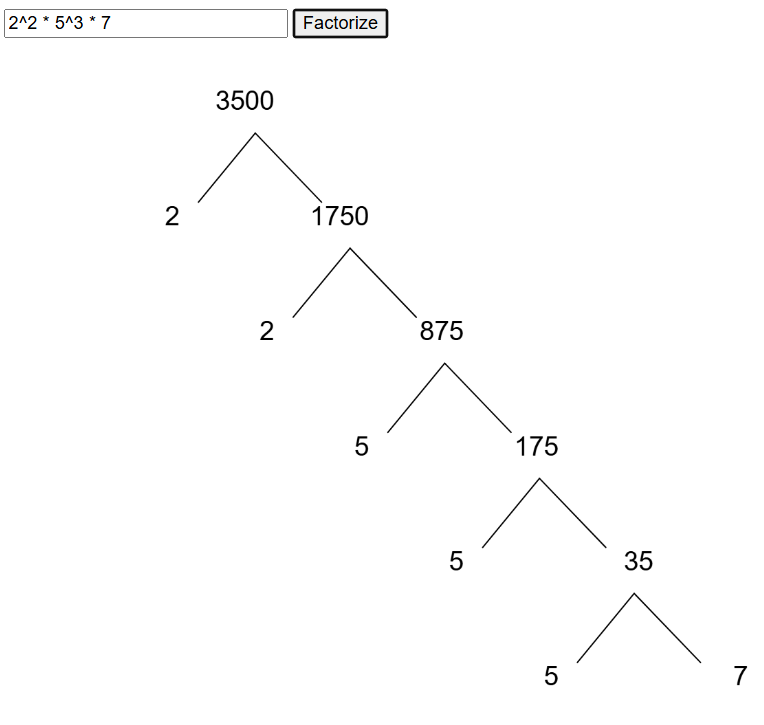

# Factor Tree Generator
Enter a number or an expression to view it's prime factor tree

> Click the image above to try it live on GitHub Pages.

> Click the image above to try it live on GitHub Pages.
